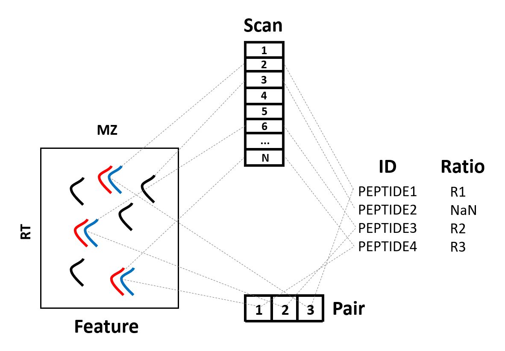

# isoOpen (eyes open)
Brighten the dark coner of proteome with heavy light

## Python tools for mass spectrometry data analysis

### Features

1. Extract features from MS1 ( peptide feature or paired features )
2. Mapping MSFragger identification results to features
3. Denoising open search result and pick up modification signals
4. Generating inclusion list for targeted quantification

###  Usage

